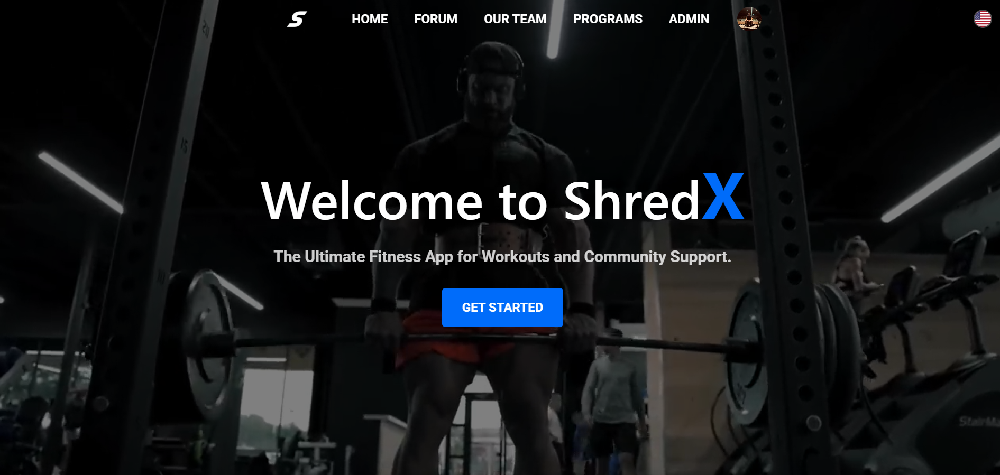

# ShredX

✍️ **App Overview**  
ShredX is a web application designed to offer a fitness forum and training programs. It provides users with an interactive community for discussing fitness topics and access to various workout programs to help them achieve their fitness goals. The application features both public and private sections, with personalized profiles and exclusive content for registered users.



Users can register for an account, participate in the forum discussions and browse fitness programs.With a focus on both social interaction and structured workout plans, ShredX aims to create an engaging fitness experience for all users.

---

🌎 **Public Part**  
The pages accessible to guests (non-logged-in users) are:
- Home
- Forum
- Register
- Login
- Our team
- Privacy Policy
- Terms of Service
- Contact
- FAQ

👤 **Private Part**  
The pages accessible to logged-in users are:
- Programs (Buy fitness programs)
- User Profile (View posts in forum ,liked posts and bought programs)
- Logout

---
🔐 **Admin Part**  
The pages accessible to guests (admin users) are:
- Admin Panel
- User Management(user accounts ,profile verification ,user privileges)
- Forum Management(post moderation ,comment management ,content filtering)
- Analytics(User activity trends ,program sales metrics ,platform performance)

**❗ To access the admin panel, you first need to create a user profile with the following credentials:**

- **Email:** shredxadmin@gmail.com
- **Password:** admin123456
---

🧑 **User Features**  
- Access to fitness programs
- View user profile(Posts in forum, liked posts and bought programs.Users can also change and upload their profile picture)
- Forum participation(Create post ,delete post, like post, comment ,like comment and delete comment)
- Logout functionality

---
### Follow these steps to get the ShredX application up and running on your local machine for development and testing purposes.
---

### **Client Application Setup**

1. **Clone the Repository**:  
   You can clone the repository using the following command or download it as a ZIP file and extract it on your computer.

   ```bash
   git clone https://github.com/viktorkortsanov/ShredX.git
   ```

2. **Navigate to the Project Directory**:  
   Use the terminal to navigate to the project directory.

   ```bash
   cd shredx
   ```

3. **Navigate to the Client Directory**:  
   Go to the client directory.

   ```bash
   cd client
   ```

4. **Install Dependencies**:  
   Install all the necessary dependencies by running the following command in your terminal:

   ```bash
   npm install
   ```

5. **Run the Client Part**:  
   Start the React development server with this command:

   ```bash
   npm run dev
   ```

6. **Open the Project**:  
   Access the application by opening the following URL in a web browser:  
   `http://localhost:5173/`

---

### **Server Part Setup**

**Before setup the server part download MongoDB and Node.JS**

Download MongoDB from here **[MongoDB Community Edition](https://www.mongodb.com/try/download/community)**.
Download Node.JS from here **[Node.JS](https://nodejs.org/en/download)**.

1. **Navigate to the Server Directory**:  
   Go to the server directory:

   ```bash
   cd server
   ```

2. **Install Server Dependencies and Start the Server**:  
   Execute the following commands in order to start the server.

   ```bash
   npm install
   npm start
   ```

3. **Running the Server**:  
   Once the server is started, it will listen for requests on:  
   `http://localhost:3030/`

---
### **Client Tests Setup**

1. **Navigate to the Client Directory**:  
   Go to the client directory.

   ```bash
   cd client
   ```

2. **Choose the file you want to test**:

   For example:

   ```bash
   npm test Login.test.jsx
   ```

---

🛠️ **Technologies and Tools**  

<p align="left">
  
  
  
  
  
  
  
  
  
    
</p>

---

📚 **Libraries**
- **React Router**: For handling navigation between different pages
- **Cookie-Parser**: For handling cookies in the backend
- **Bcrypt**: For hashing passwords
- **EmailJS**: For sending emails from the client-side
- **Mongoose**: For interacting with MongoDB in the backend
- **JsonWebToken**: For creating and verifying JSON Web Tokens
- **Cors**: For enabling Cross-Origin Resource Sharing (CORS)
- **Firebase**:  A platform for hosting, authentication, and real-time database services
- **Recharts**: A React-based charting library for building data visualizations
- **Vitest**: A fast and lightweight testing framework for modern JavaScript and TypeScript projects, designed as a Vite-native alternative to Jest.
- **i18next**: A library for internationalization and translation management
- **React Icons**: A collection of icons for easy integration into React applications